# Guía de Configuración de Entornos de Desarrollo

> 📋 **Guía Técnica**: Esta documentación establece los procedimientos para configurar un entorno de desarrollo en C# y otros lenguajes. Incluye las configuraciones necesarias para mantener consistencia en el desarrollo de software.

> **Nota importante**: Este documento se enfoca en aspectos técnicos y procedimientos. Para análisis comparativos, reflexiones personales y conclusiones, utiliza el archivo `CONCLUSIONES_EVALUACION.md`.

**Autores**: Diana y Gustavo
**Fecha V0**: 03/10/2025
**Fecha V1**: [Fecha de entrega final]

---

## Visual Studio Code - Entorno Principal

### Instalación y Verificación

**Método de instalación:**  Se descargar directamente desde la página oficial de Visual Studio Code

**Proceso de instalación:**

- **Descarga:** 

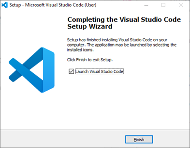

1. Ve a la pagina (https://code.visualstudio.com/)
2. Descaga VS Code segun tu sistema operativo 
3. Instalalo 
4. Abrelo y empieza a usarlo 

- **Opciones del instalador:** 


1. Aceptar licencia
2. Seleccionar carpeta
3. Agregar a PATH
4. Registrar VS Code como editor predeterminado 
5. Crear accesos directos

- **Verificación:** 

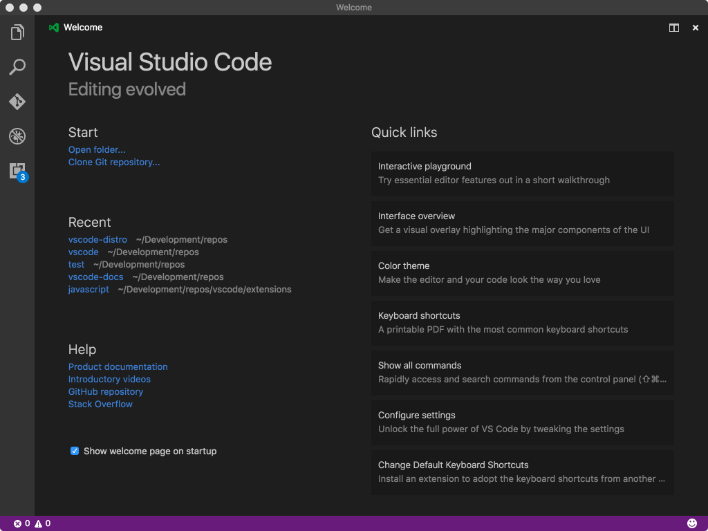

1. Abrir VS Code desde el menu o con code en la terminal 
2. Ver que se inicia sin errores y muestra la pantalla de bienvenida 

### Uso Básico de VS Code

**Navegación y funcionalidades básicas:**

- Navegación por la interfaz
- Edición de código
- Uso de la paleta de comandos (Ctrl+Shift+P)
- Gestión de archivos y carpetas

### Personalización del Entorno

**Configuraciones aplicadas:** 

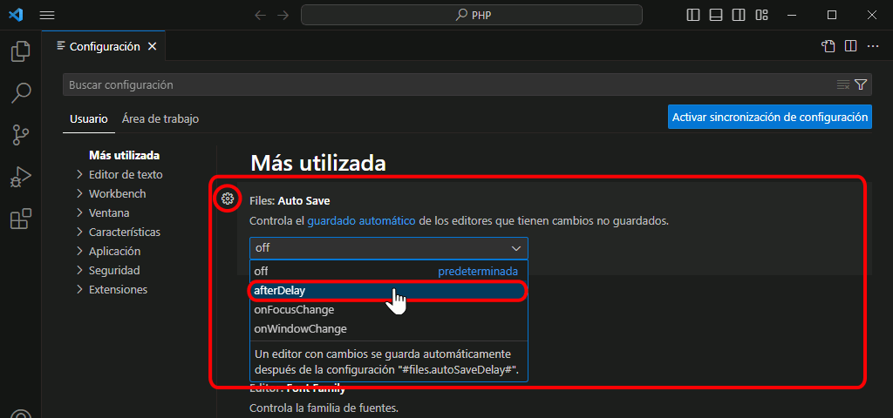

- Tema oscuro
- Fuente Consolas, tamaño 14
- Autoguardado activado
- Formateo automatico al guardar (Prettier, ESLint)
- Extensiones segun lenguaje (Python, C++, JavaScript,etc)
- Atajos de teclado personalizados para comandos frecuentes 
- Barra lateral organizada con explorador y control de versiones 

Ejemplo de configuraciones utiles:

- Cambiar tema (oscuro / claro)
- Ajustar fuente y tamaño 
- Auto-guardado y formateo automatico 
- Instalar extensiones segun lenguaje
- Personalizar atajos de teclado 
- Organizar paneles y barra lateral 

**Temas e iconos:**

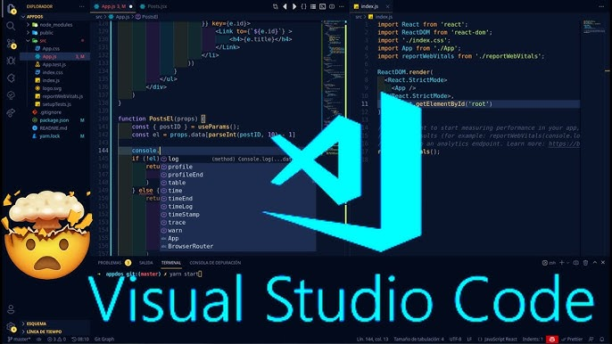

Ejemplos:

- Material Theme, One Dark Pro, Dracula, Solarized Dark,Night Owl 
- File Icon Theme para mejor identificación de archivos

**Configuración de fuentes:**

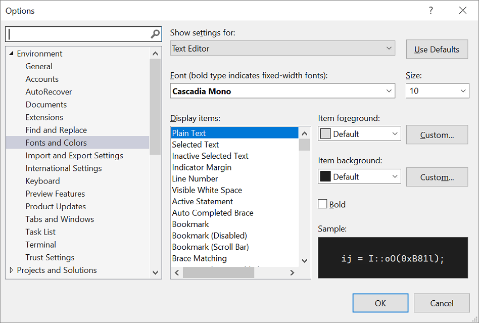

Ejemplos:

- Fira Code, JetBrains Mono (con ligaduras)

**Atajos de teclado útiles:**

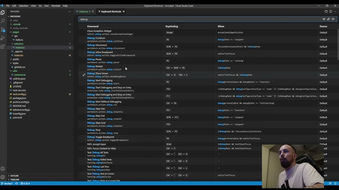

Ejemplos:

- Ctrl+/ para comentar/descomentar
- Ctrl+Shift+P para paleta de comandos
- Ctrl+` para terminal integrada
- Alt+↑/↓ para mover líneas

**Configuración del editor:**

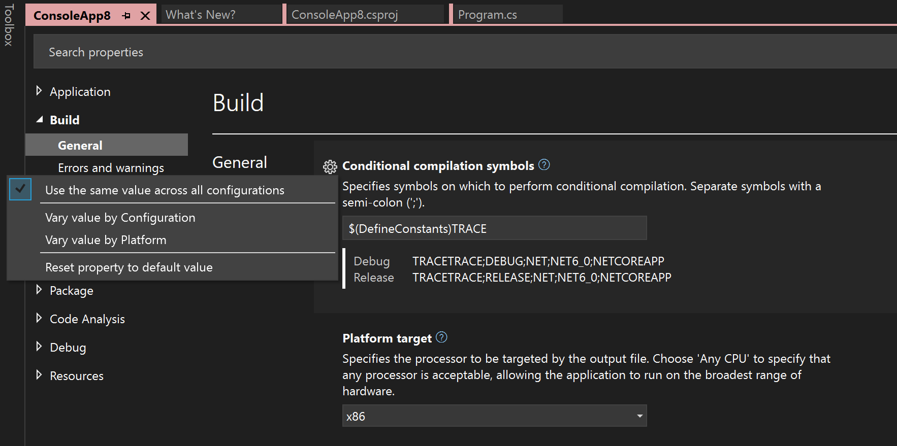

Ejemplos:

- Formateo automático al guardar
- Detección automática de indentación
- Word wrap para líneas largas

**Terminal integrada:**

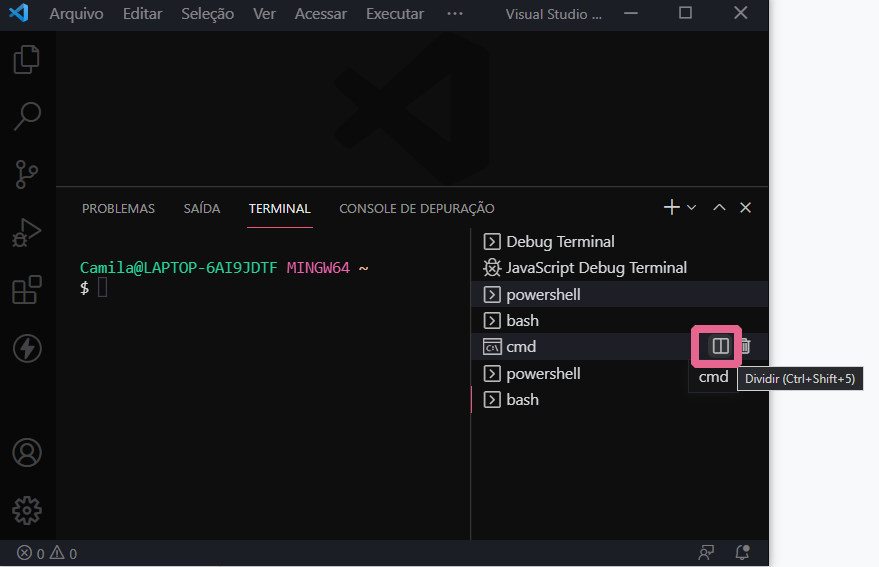

Ejemplos:

- PowerShell como terminal predeterminado
- Configuración de perfil personalizado

> **Personaliza según tus necesidades**: Estas son sugerencias basadas en prácticas comunes. Experimenta y documenta las configuraciones que encuentres más útiles para tu flujo de trabajo.> 💼 **Manual de Incorporación**: Esta guía establece los estándares del equipo para configurar entornos de desarrollo en C#. Cualquier nuevo desarrollador debe poder seguir estas instrucciones para configurar su entorno de trabajo de manera consistente con el resto del equipo.

### SDK .NET

**Proceso de instalación:**

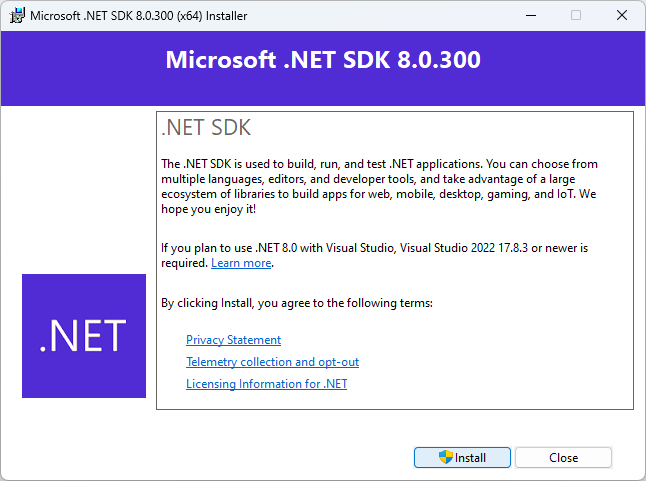

1. **Descarga e instalación:** 

   1. Descarga el instalador del .NETSDK desde (https://dotnet.microsoft.com/es-es/download) 
   2. Sigue las instrucciones del asistente hasta completar la instalacion
   3. !Listo! El SDK .NET estara instalado en tu equipo

2. **Verificación:** 
   
   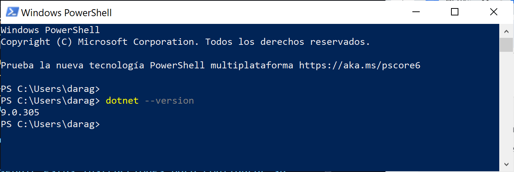

   1. Abre una terminal o PowerShell y ejecuta:

      ```
       dotnet --version
      ```
   2. Si aparece un numero de version, el SDK se instalo correctamente!


### Configuración para C#

**Extensiones esenciales:**

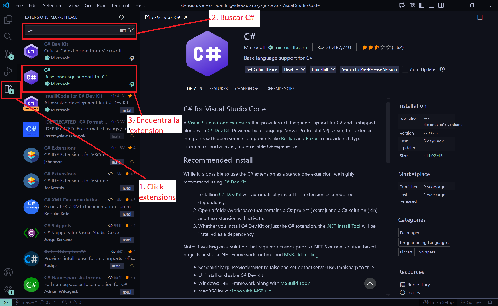

- **Soporte oficial para C#**: Extensión que proporciona IntelliSense, debugging y compilación

   - Extension: ms-dotnettools.csharp

Nota: Con esta extensión y el .NET SDK instalado, ya puedes crear, ejecutar y depurar proyectos C# sin necesidad de nada más.

**Configuraciones específicas para C#:** 

- **Formateo automatico**:Se activa al guardar para mantener el codigo limpio y ordenado.
- **IntelliSense**: Ayuda a autocompletar el codigo y sugiere métodos, clases y variables mientras escribes.
- **Compilador**: Permite ejecutar proyectos con dotnet run directamente desde la terminal integrada.
- **Depuracion (debug)**: Configurando con launch.json para detener y revisar el codigo paso a paso en tiempo real.

**Debugging básico:**

- **Puntos de interrupción (breakpoints):** Haz clic en el margen izquierdo del editor junto a la línea de código donde quieras detener la ejecución.  
 
 

- **Ejecutar y depurar:** Presiona `F5` o selecciona "Run and Debug" en la barra lateral para iniciar la depuración de tu proyecto.  

 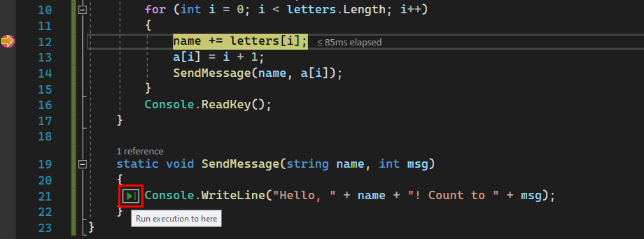

- **Inspección de variables:** Durante la depuración, usa el panel de depuración para revisar valores de variables, el flujo de ejecución y la pila de llamadas.  

 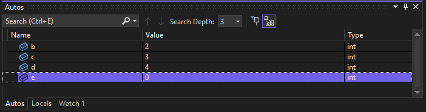


> **Enfoque práctico**: Concentra tu documentación en las funcionalidades básicas que usarás día a día.

### Flujo de Trabajo con C#

**Creación de proyectos:**

   1. Abrir VS Code
   2. Crear una carpeta para tu proyecto 
   3. Abrir la caroeta en VS Code
   4. Abrir la terminal integrada en VS Code
   5. Escribir en la terminal: 

      ```
       dotnet new console -o MiProyecto
      ```
   6. ¡Listo! Tu proyecto de C# ya está creado

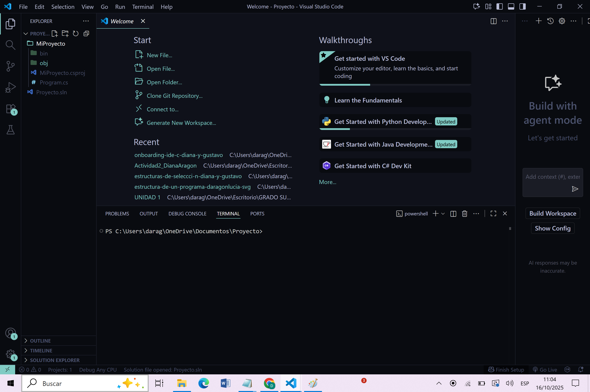

**Estructura de proyecto:**

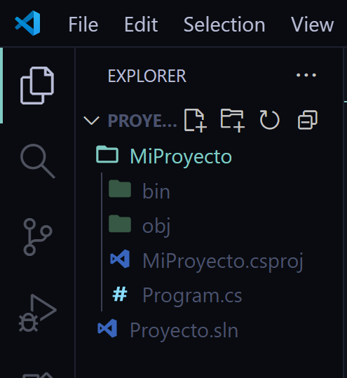

   bin/ : Carpeta con los archivos compilados
   obj/ : Archivos temporales de compilacion 
   MiProyecto.csproj : Archivo de configuracion del proyecto
   Program.cs : Codigo Principal del proyecto
   Proyecto.sln : Archivo de solucion que agrupa proyectos

- **Program.cs - Codigo generado por defecto**

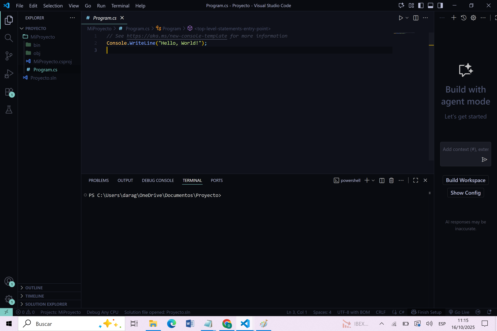

- **Comentarios sobre las decisiones tomadas:**

   Program.cs contiene el código que se ejecuta al iniciar el proyecto.
   Console.WriteLine imprime un mensaje en la terminal.
   MiProyecto.csproj y Proyecto.sln gestionan la configuración y organización del proyecto.
   bin/ y obj/ son carpetas generadas automáticamente al compilar y no se modifican manualmente.


**Compilación y ejecución:**

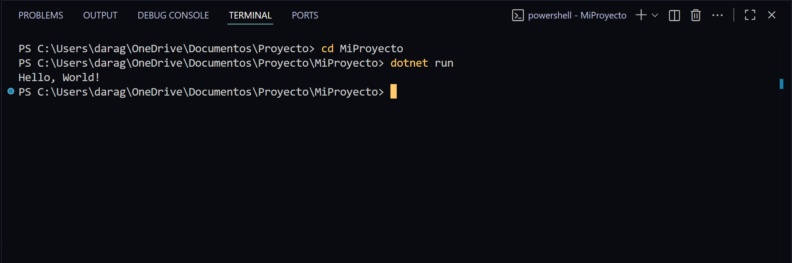

   1. Abrir la terminal integrada en VS Code
   2. Asegurarse de estar dentro de la carpeta del proyecto, escribir el comando: 
   
      ```
          cd MiProyecto
      ```
   3. Ejecutar el proyecto, escribir: dotnet run 
   4. Listo! verificar la salida de la terminal
      Hello, World!

**Debugging:**

   1. Abrir Program.cs en VS Code.
   2. Agregar un breakpoint haciendo clic a la izquierda de la línea.
   3. Presionar Run and Debug en la barra lateral izquierda o en la parte superior.
   4. Seleccionar Debug Project Associated With This File
   5. Ver variables y flujo de ejecución en el panel de depuración.
   6. Presionar F5 para continuar la ejecución.

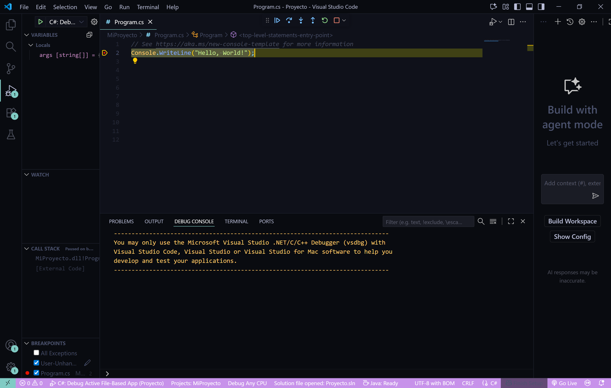

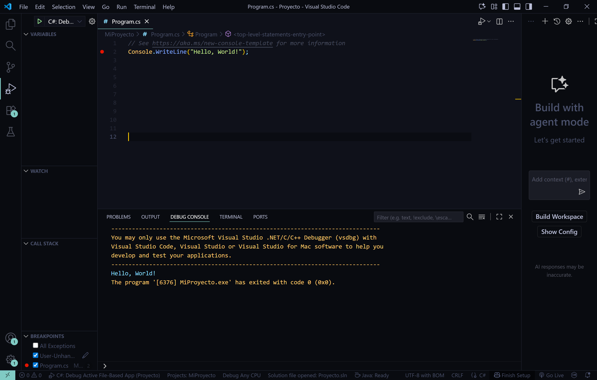

## Visual Studio - IDE Alternativo

### Instalación

**Proceso de instalación:**

- **Descarga:**

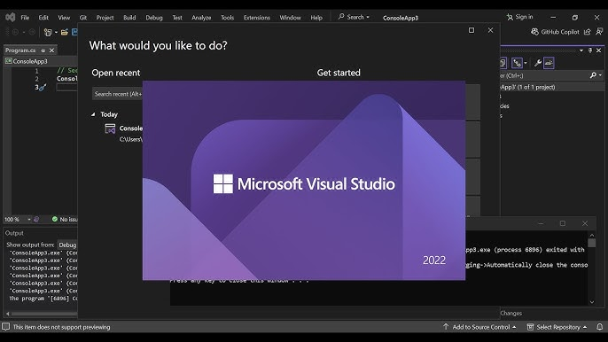

   1. Ve a la pagina (https://visualstudio.microsoft.com/es/)
   2. Hacer clic en Descargar Visual Studio (esto descarga el instalador).
   3. Ejecutar el instalador 
   
- **Componentes necesarios:**

   1. Durante la instalación, seleccionar la carga de trabajo “Desarrollo de escritorio con .NET”.
   2. Esto incluye soporte para C#, .NET SDK, depuración y herramientas de compilación.

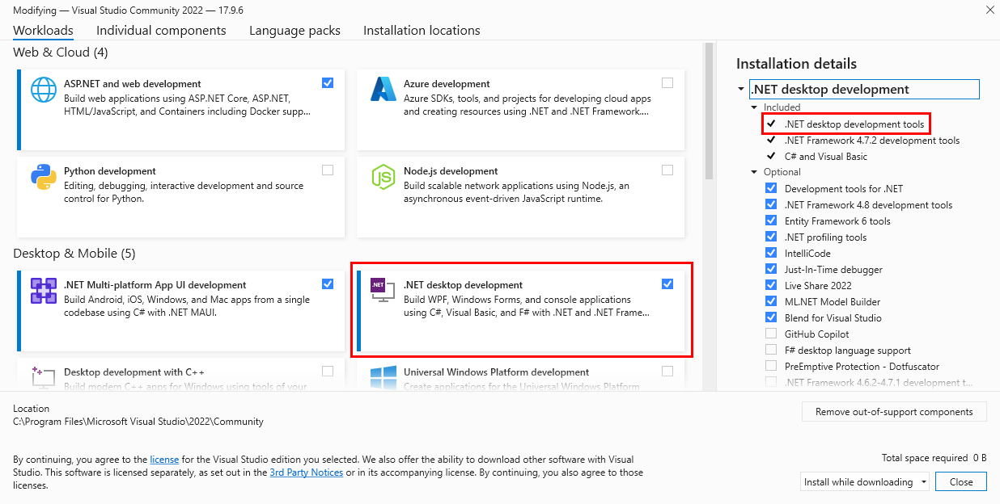

- **Verificación:** 

1. Abrir la solución MiSolucion.sln.
2. Seleccionar como proyecto de inicio el que contiene Program.cs
3. Ejecutar el proyecto con Ctrl + F5
4. Verificar la salida en la consola:

    ```
      Hello, World!
   ```

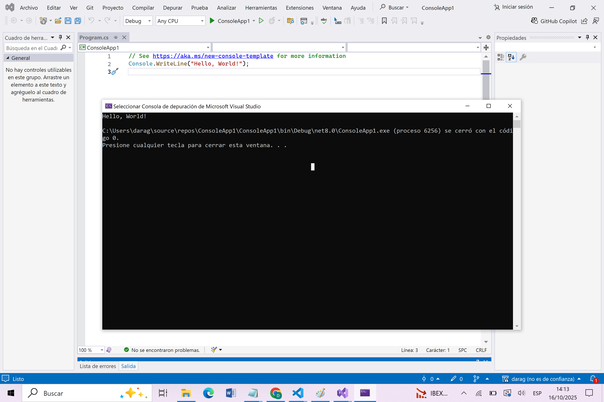

### Desarrollo con C#

**Creación de proyecto:**
 1. Abrir Visual Studio
 2. Hacer clic en "Crear un nuevo proyecto"

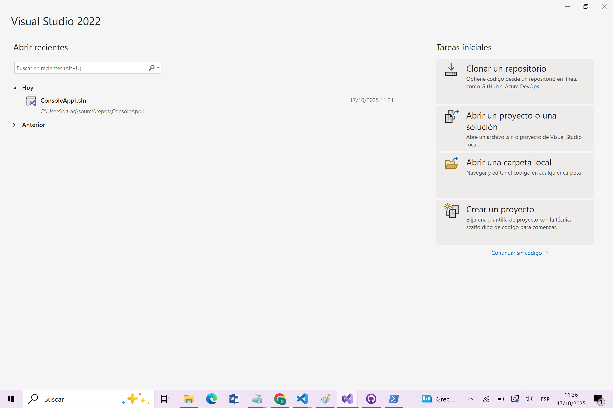

 3. Seleccionar "Aplicacion de consola (.NET)" 

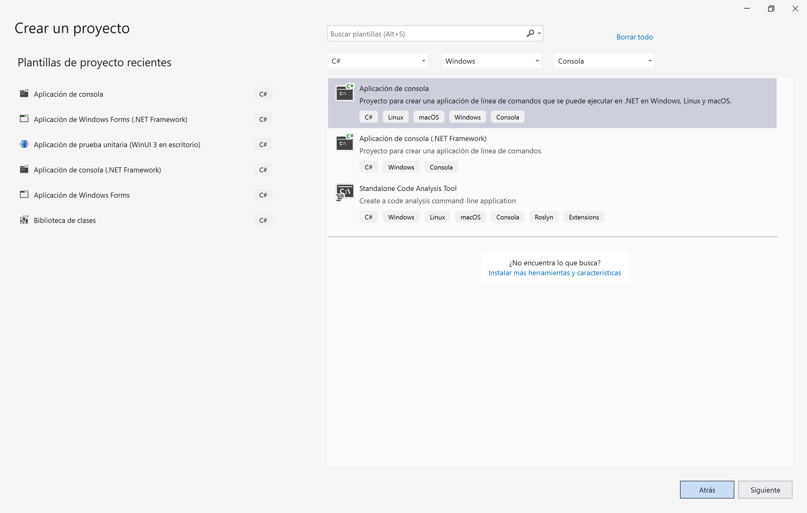

 4. Escribir un nombre para el proyecto y elegir la carpeta donde se guardara

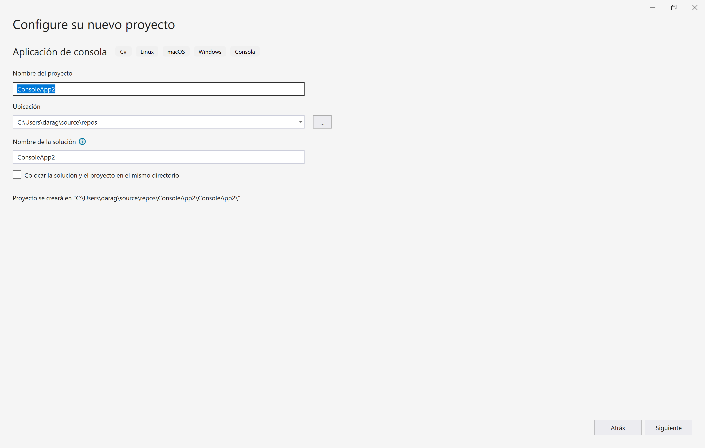

 5. Hacer clic en Crear

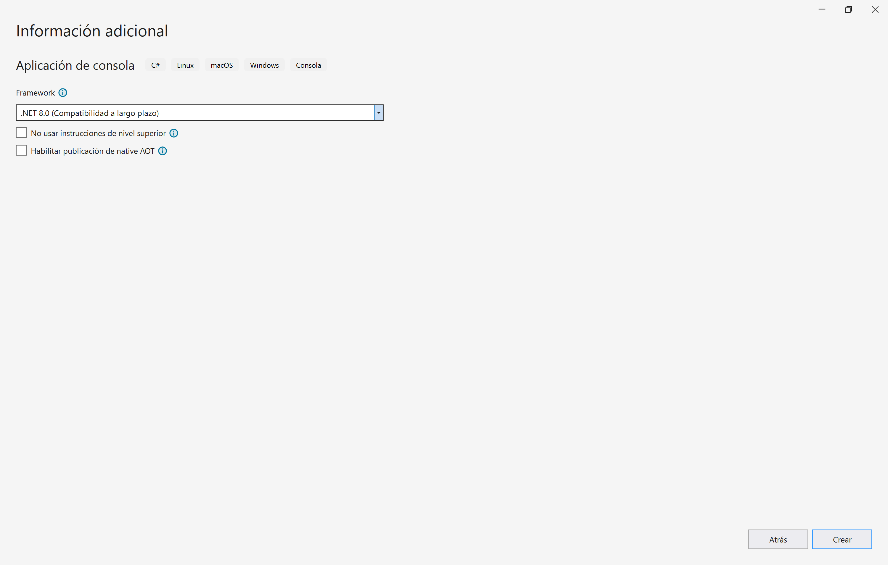

 6. Se crea automaticamente la estructura del proyecto con el archivo (Program.cs) listo para usar.

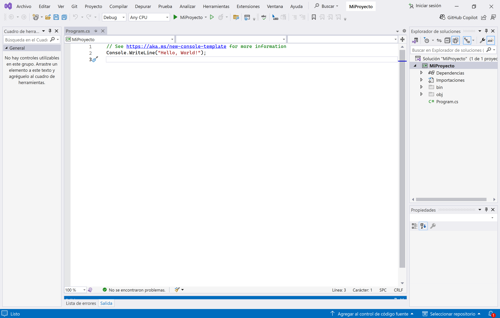

**Flujo de trabajo básico:**
- Compilación y ejecución

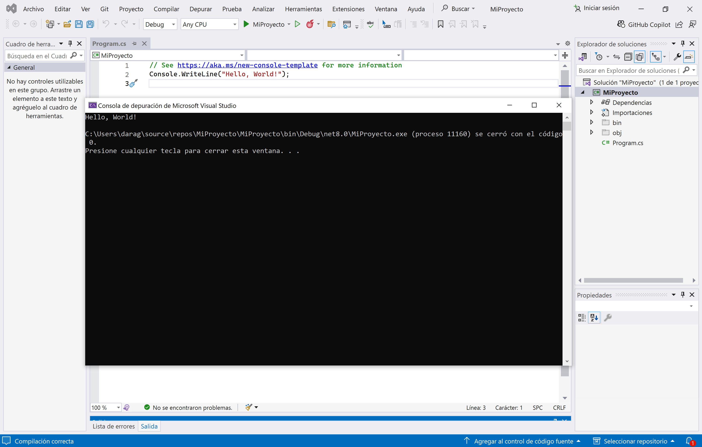

   1. Seleccionar el proyecto a ejecutar como proyecto de inicio
   2. Ejecutar con Ctrl + F5
   3. Verificar que la consola muestre:

   ```
      Hello, World!
   ```
- Uso de Solution Explorer

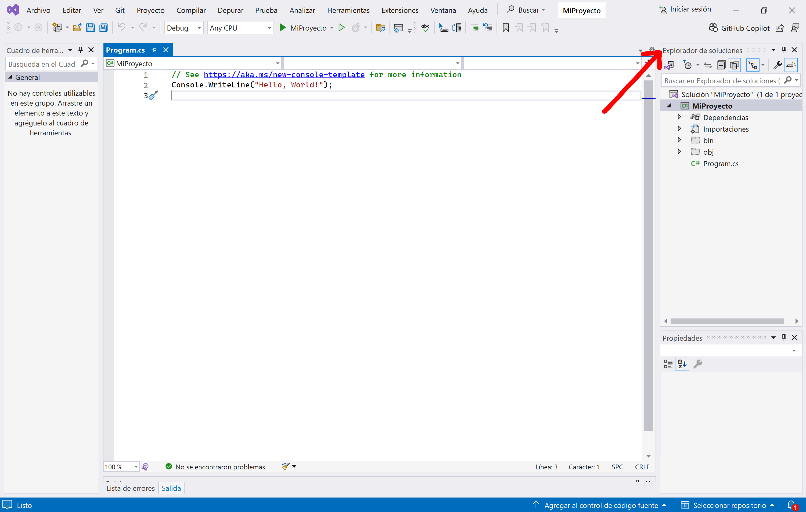

   Navegar por archivos y carpetas del proyecto.
   Abrir, modificar o agregar nuevos archivos.

- Debugging básico

   1. Abrir Program.cs
   2. Colocar breakpoints haciendo clic a la izquierda de la linea deseada.
   3. Presiona F5
   4. Observar variables y flujo de ejecucion en el panel de depuracion

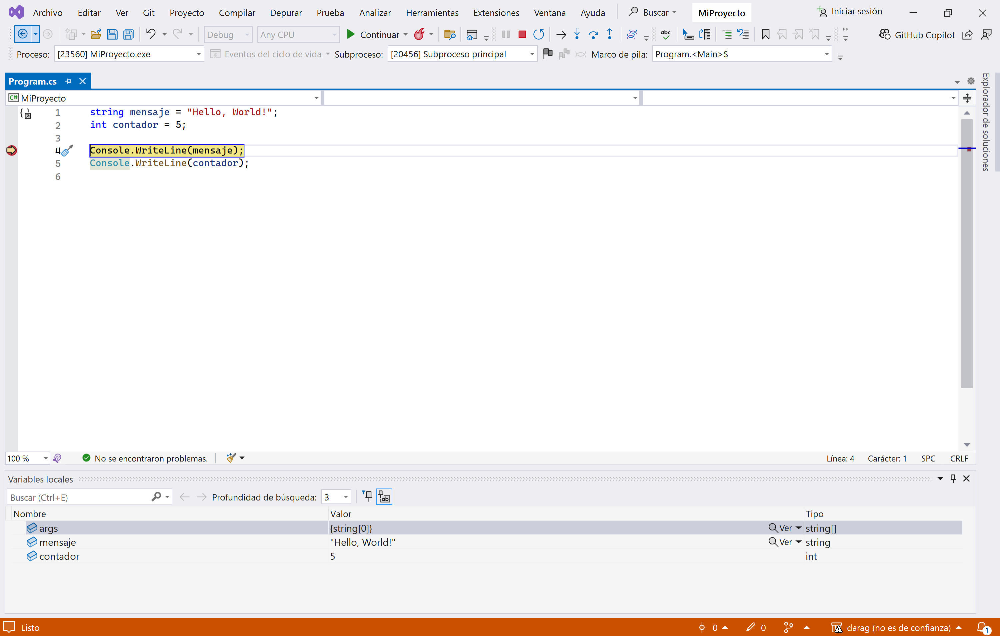

---

## Configuración de Lenguaje Adicional

**Lenguaje seleccionado:** Python
**Justificación:** Fácil de entender, sintaxis clara y directa, permite probar código rápido, se integra bien con VS Code y se puede usar en muchos tipos de programas diferentes.

### Instalación del Entorno

**Runtime/SDK:**
- **Descarga e instalación:** 

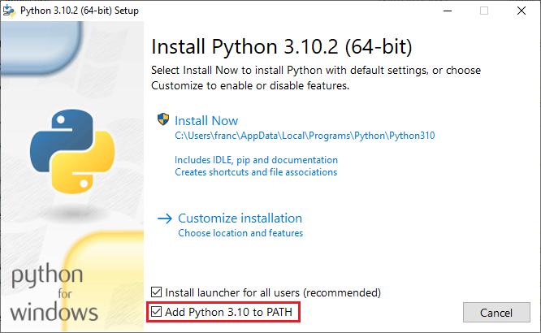

   1. Ve a la página https://www.python.org/downloads/
   2. Descarga la ultima versión para tu sistema operativo
   3. Ejecuta el instalador y marca Add Python to PATH
   4. Completa la instalación siguiendo el asistente
   5. Abre la terminal y escribe python --version para verificar que se instaló correctamente

- **Verificación:** 
   1. Abrir la terminal o PowerShell
   2. Escribir el comando:

    ```
      python --version
    ```

### Configuración en VS Code

**Extensiones por lenguaje:**

*Para Java:*
- **Paquete completo de Java**: Incluye compilación, debugging y gestión de proyectos

*Para Python:*
- **Soporte oficial de Python**: Extensión completa con intérprete y debugging

*Para otros lenguajes:*
- Busca la extensión oficial del lenguaje que proporcione soporte completo

**Configuraciones específicas aplicadas:**
[Documentar los ajustes que se realizaron, como configuración del intérprete, formateo automático, linting, etc.]

### Proyecto de Ejemplo

**Código desarrollado:**
```[lenguaje]
// Código de ejemplo aquí
// Comentarios explicativos
```

**Proceso de ejecución:**
[Describir cómo ejecutar el código]

---

## Configuraciones Recomendadas

**Configuraciones generales:**
[Documentar configuraciones que se consideran útiles para cualquier desarrollador]

**Herramientas adicionales:**
[Extensions, herramientas CLI, o utilidades que se consideran beneficiosas]

**Solución de problemas comunes:**
[Problemas frecuentes durante la configuración y sus soluciones]

**Recursos útiles:**
- Enlace [Enlace]: [Descripción]
- Documentación [Documentación]: [Descripción]

---
